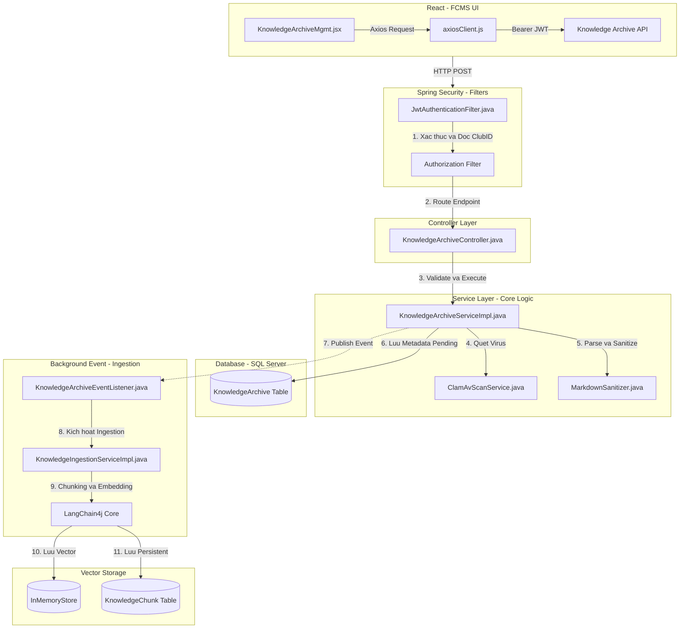
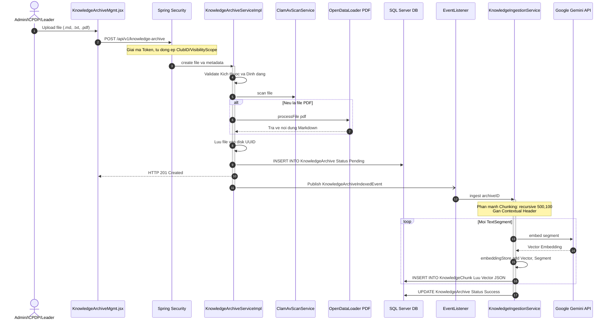
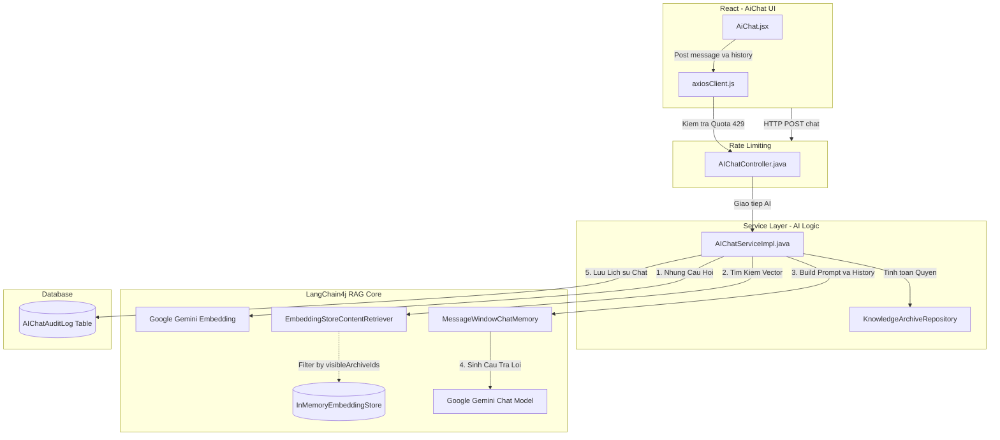
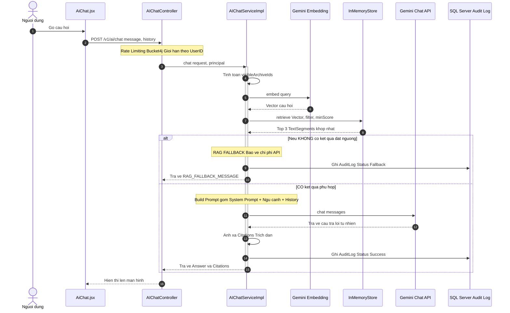

# Tài liệu này mô tả chi tiết Vòng đời (Lifecycle) và Ngăn xếp cuộc gọi (Call Stack) của hệ thống **FCMS (FPT Club Management System)** cho luồng nghiệp vụ:
**Quản lý Kho tri thức (Knowledge Archive) và Trợ lý ảo AI (AI Chatbot RAG).**

*(Lưu ý quan trọng: Luồng nghiệp vụ này tích hợp chặt chẽ với cơ chế bảo mật (JWT Claims) của hệ thống và ứng dụng kiến trúc **LangChain4j** nhằm chuẩn hóa quá trình Vector hóa (Embedding) cũng như Sinh văn bản dựa trên ngữ cảnh (Retrieval-Augmented Generation).)*

---

### PHẦN 1: QUẢN LÝ KHO TRI THỨC (INGESTION & INDEXING)

#### 1. Sơ đồ Call Stack (Ngăn xếp cuộc gọi) - Quá trình Upload & Indexing

---

#### 2. Luồng Xử lý Upload và Vector hóa dữ liệu

#### 3. Chi tiết các thành phần xử lý

| Tầng | Tên File / Lớp | Phương thức | Vai trò chi tiết trong luồng xử lý |
| :--- | :--- | :--- | :--- |
| **Frontend UI** | `KnowledgeArchiveMgmt.jsx` | `handleUpload()` | Giao diện quản lý file dùng chung cho cả 4 role. Thu thập metadata (ClubID, Visibility). File được nén vào FormData để gửi. |
| **Security Gate** | `KnowledgeArchiveController.java` | `@PreAuthorize` | **Phân quyền logic:** Admin/ICPDP tự chọn `Public/Internal`. Club Leader/Vice Leader tự động bị ép vào `ClubInternal` và `ClubID` cá nhân. |
| **Service (Sync)** | `KnowledgeArchiveServiceImpl.java` | `create(...)` | - **Kiểm duyệt (Validation):** Ép giới hạn 5MB, kiểm tra định dạng. - **Anti-virus:** Bắt buộc quét bằng ClamAV. - **PDF Parsing:** Dùng `opendataloader` chuyển PDF sang Markdown. - **XSS Protection:** Gọi `MarkdownSanitizer`. - **Database & Event:** Lưu DB trạng thái `Pending` và bắn Event `AFTER_COMMIT`. |
| **Event (Async)** | `KnowledgeArchiveEventListener.java` | `onIndexedEvent()` | Lắng nghe Event sau khi transaction thành công để gọi `KnowledgeIngestionService` không làm block request của user. |
| **Service (Async)** | `KnowledgeIngestionServiceImpl.java` | `ingest(...)` | - Cắt nhỏ văn bản: `recursive(500, 100)`. - Gắn Tiêu đề vào mỗi chunk để chống mất ngữ cảnh. - Gọi Gemini nhúng Vector. - Lưu vào RAM Store và DB để Persistent. |
| **Repository** | `KnowledgeArchiveRepository` | `save(...)` | Lưu trữ file gốc và metadata. |
| **Repository** | `KnowledgeChunkRepository` | `save(...)` | Lưu các Vector (Embedding) và `embeddingStoreId` nhằm phục hồi dữ liệu khi App restart. |

---

### PHẦN 2: LUỒNG TRỢ LÝ ẢO AI (AI CHATBOT RAG)

#### 1. Sơ đồ Call Stack (Ngăn xếp cuộc gọi) - Luồng AI Chat

---

#### 2. Luồng Sinh viên chat với AI Chatbot

#### 3. Chi tiết các thành phần xử lý AI

| Tầng | Tên File / Lớp | Phương thức | Vai trò chi tiết trong luồng xử lý |
| :--- | :--- | :--- | :--- |
| **Frontend UI** | `AiChat.jsx` | `handleSendMessage()` | Thu thập `message` và tự động gom tối đa 5 lượt hỏi/đáp vào mảng `history`. Gửi request lên API. Xử lý UI báo lỗi 429 nếu bị rate limit. |
| **Rate Limit** | `AIChatController.java` | `chat(...)` | **Khóa tài nguyên:** Sử dụng thư viện Bucket4j map với UserID để cấu hình Rate Limit. Trả về `429 Too Many Requests` nếu sinh viên spam liên tục. |
| **Service Logic** | `AIChatServiceImpl.java` | `chat(...)` | - **Bảo mật Data:** Tự động tính toán các tài liệu user được xem để tạo `Filter`. - **Truy xuất RAG:** Dùng Retriever của LangChain4j tìm kiếm top 3 đoạn văn phù hợp nhất với câu hỏi. - **Cơ chế Fallback (Tiết kiệm cost):** Nếu không tìm thấy ngữ cảnh trên mức tự tin (`minScore`), lập tức trả lời mẫu Fallback mà **không** gọi tới Gemini Chat. - **Prompt Engineering:** Ráp các TextSegments vào System Prompt để dẫn dắt Gemini trả lời. |
| **RAG LLM Engine** | `LangChain4jConfig.java` | Cấu hình Beans | Khai báo các mô hình riêng biệt: `documentEmbeddingModel` (lúc nạp data), `queryEmbeddingModel` (lúc sinh viên hỏi) và `geminiChatModel` (lúc tạo câu trả lời). |
| **Repository** | `AIChatAuditLogRepository` | `save(...)` | **Ghi Log (Audit):** Toàn bộ câu hỏi, câu trả lời AI, số lượng Tokens đã dùng, trạng thái (Success/Fallback) và danh sách nguồn trích dẫn được lưu cứng để Admin kiểm soát chất lượng AI. |

---

### Tác động Dữ liệu (Database Consistency)

Trong toàn bộ chuỗi tính năng này, sự toàn vẹn hệ thống dựa trên 3 bảng dữ liệu chính:

1. **`KnowledgeArchive`**: 
   - Quản lý metadata, đường dẫn vật lý và tính phân quyền (`ClubInternal` / `Public`). Cột `indexingStatus` (Pending/Processing/Success/Failed) cho biết trạng thái Vector hóa.
2. **`KnowledgeChunk`**: 
   - Lưu trữ các mảnh vỡ văn bản (Chunks) và Vector toán học (`embeddingVector`) đã được parse. Bảng này hỗ trợ ứng dụng tự **rehydrate (phục hồi)** lại dữ liệu RAM (`InMemoryEmbeddingStore`) ngay cả khi Server sập/restart.
3. **`AIChatAuditLog`**:
   - Ghi vết mọi lượt trò chuyện. Hỗ trợ trường `citationsJson` để sau này có thể truy vết AI sinh câu trả lời dựa vào mảnh văn bản cụ thể nào, giúp chống lại hiện tượng Ảo giác (Hallucination) của AI.

---
Mọi tác động sửa đổi hệ thống, nếu thay đổi 1 trong 3 cơ chế trên đều sẽ tự động Rollback (đối với Upload) hoặc trả về Fallback an toàn (đối với Chat).
