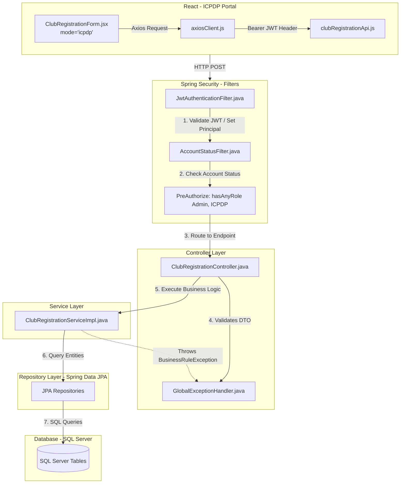
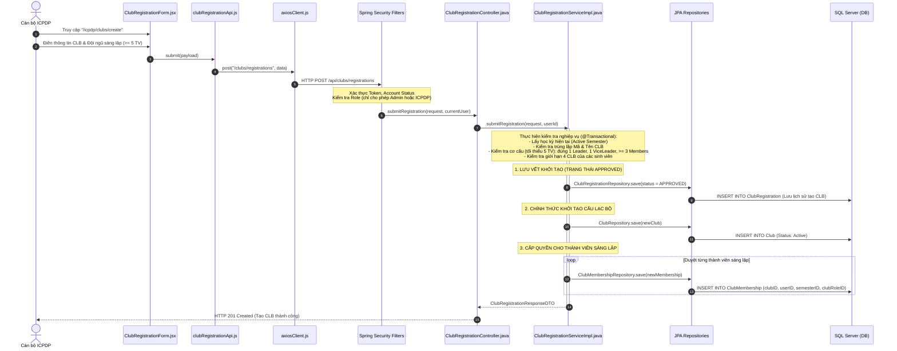

Tài liệu này mô tả chi tiết Vòng đời (Lifecycle) và Ngăn xếp cuộc gọi (Call Stack) của hệ thống **FCMS (FPT Club Management System)** cho luồng nghiệp vụ:
**Cán bộ ICPDP trực tiếp khởi tạo Câu lạc bộ mới trên hệ thống.**

*(Lưu ý quan trọng: Dựa theo bản cập nhật mới nhất, **sinh viên không còn quyền nộp đơn đăng ký CLB**. Chức năng này đã được chuyển hoàn toàn sang cho cán bộ ICPDP tự khởi tạo. Dù API Backend vẫn giữ tên là `ClubRegistration` để lưu vết dữ liệu (audit log), nhưng tính chất nghiệp vụ đã thay đổi thành Khởi tạo trực tiếp (Auto-Approve).)*

---

### 1. Sơ đồ Call Stack (Ngăn xếp cuộc gọi)

---

### 2. Luồng ICPDP tạo CLB mới và Hệ thống tự động khởi tạo

| Tầng | Tên File / Lớp (Class) | Phương thức / Thành phần | Vai trò chi tiết trong luồng xử lý |
| :--- | :--- | :--- | :--- |
| **Frontend UI** | `sidebarConfigs.js` | Menu Route | Chức năng đăng ký bị xóa khỏi menu của Sinh viên (`MEMBER`). Menu `Tạo CLB` chỉ còn nằm trong cấu hình của `ICPDP`. |
| **Frontend UI** | `ClubRegistrationForm.jsx` | `handleSubmit()` | Form được tái sử dụng để ICPDP nhập liệu. Kiểm tra trước tại frontend (MSSV, số lượng >= 5). Khi submit, dữ liệu được gửi đi như một lệnh "Tạo CLB trực tiếp". |
| **Frontend API** | `clubRegistrationApi.js` | `submit(data)` | Gọi phương thức HTTP POST `/api/clubs/registrations`. |
| **Security Gate** | `ClubRegistrationController.java` | `@PreAuthorize` | **Chặn toàn bộ sinh viên:** Có đánh dấu `@PreAuthorize("hasAnyRole('Admin', 'ICPDP')")`. Sinh viên truy cập sẽ bị `403 Forbidden`. |
| **Service** | `ClubRegistrationServiceImpl.java` | `submitRegistration(...)` | - **Kiểm tra nghiệp vụ (Validations)**: &nbsp;&nbsp;1. Kiểm tra tồn tại Học kỳ đang hoạt động. &nbsp;&nbsp;2. Kiểm tra tính duy nhất của Mã CLB và Tên CLB. &nbsp;&nbsp;3. **Đội ngũ sáng lập phải có >= 5 thành viên (1 Leader, 1 ViceLeader, >= 3 Members)**. &nbsp;&nbsp;4. Giới hạn sinh viên không tham gia quá 4 CLB trong kỳ.  - **Thực thi Tạo mới**: &nbsp;&nbsp;1. Tạo một bản ghi `ClubRegistration` với trạng thái `APPROVED` để lưu dấu vết lịch sử ai là người tạo. &nbsp;&nbsp;2. Trực tiếp tạo `Club` với trạng thái `Active`. &nbsp;&nbsp;3. Tạo ngay `ClubMembership` cho 5+ thành viên. |
| **Repository** | `ClubRegistrationRepository` | `save(...)` | Lưu trữ bản ghi tạo CLB. |
| **Repository** | `ClubRepository` | `save(...)` | Tạo dòng dữ liệu mới trong bảng `Club`. |
| **Repository** | `ClubMembershipRepository` | `save(...)` | Lưu các bản ghi chức vụ (Leader, ViceLeader, Member) vào CLB mới. |

---

### Dữ liệu bị tác động trong quá trình xử lý:

Quá trình "Tạo CLB" sẽ đồng thời sinh ra dữ liệu trên 4 bảng sau trong cùng 1 Transaction:

1. **`ClubRegistration`**:
   - Được dùng như một bảng Audit/History (Lưu vết). Trạng thái mặc định ngay khi lưu là `APPROVED`.
2. **`ClubRegistrationMember`**:
   - Lưu trữ danh sách thông tin sinh viên mà ICPDP đã khai báo trong form khởi tạo (ít nhất 5 người).
3. **`Club`**:
   - Khởi tạo ngay lập tức với `clubStatus` là `Active`, sử dụng tên và mã CLB từ form ICPDP nhập.
4. **`ClubMembership`**:
   - Bảng quyền lực nhất: Cấp phát chức vụ chính thức (`Leader`, `ViceLeader`, `Member`) cho 5+ thành viên tương ứng vào CLB mới.

### Cơ chế bảo vệ toàn vẹn:
Nếu cán bộ ICPDP nhập sai MSSV, hoặc trong 5 người có người đã tham gia đủ 4 CLB, tiến trình `@Transactional` sẽ rollback toàn bộ. `GlobalExceptionHandler` trả về HTTP 422 / 400 kèm câu thông báo lỗi chi tiết hiển thị cho ICPDP biết để sửa đổi.
