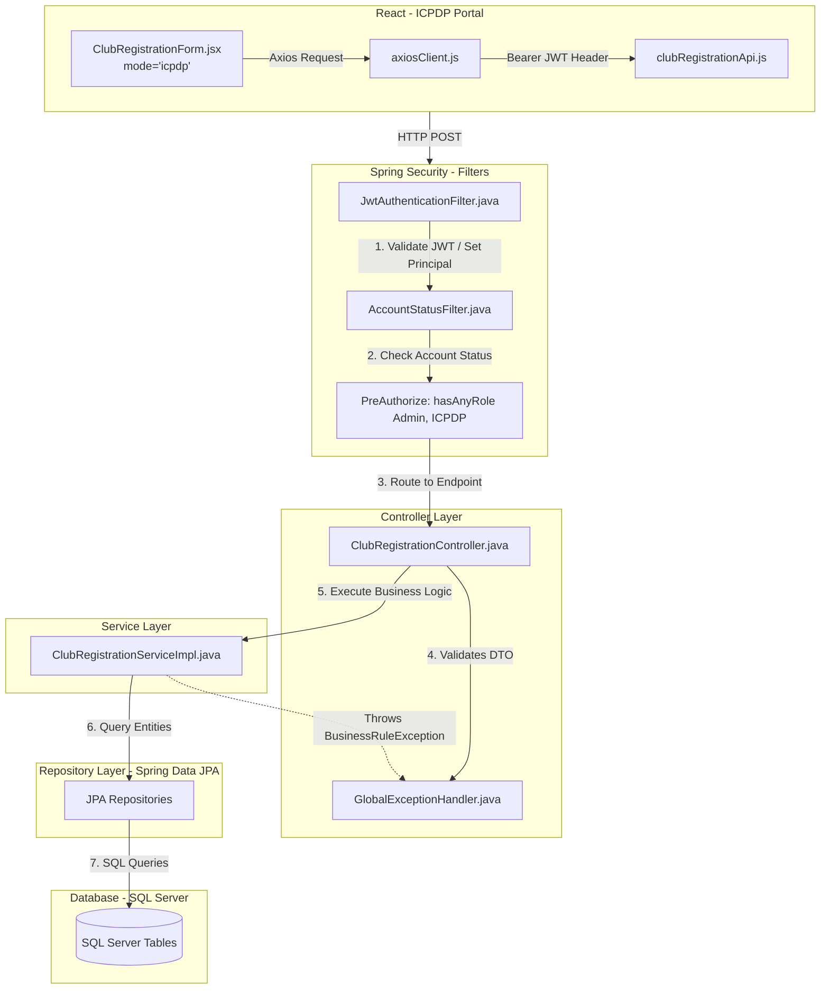
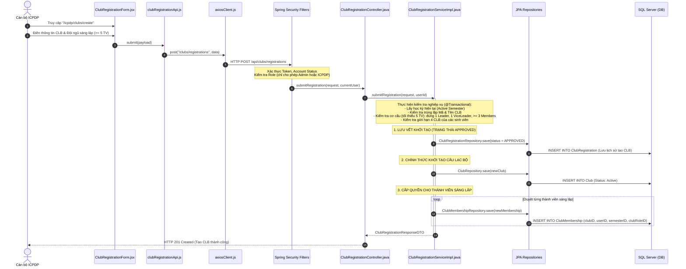

Tài liệu này mô tả chi tiết Vòng đời (Lifecycle) và Ngăn xếp cuộc gọi (Call Stack) của hệ thống **FCMS (FPT Club Management System)** cho luồng nghiệp vụ:
**Cán bộ ICPDP trực tiếp khởi tạo Câu lạc bộ mới trên hệ thống.**

*(Lưu ý quan trọng: Dựa theo bản cập nhật mới nhất, **sinh viên không còn quyền nộp đơn đăng ký CLB**. Chức năng này đã được chuyển hoàn toàn sang cho cán bộ ICPDP tự khởi tạo. Dù API Backend vẫn giữ tên là `ClubRegistration` để lưu vết dữ liệu (audit log), nhưng tính chất nghiệp vụ đã thay đổi thành Khởi tạo trực tiếp (Auto-Approve).)*

---

### 1. Sơ đồ Call Stack (Ngăn xếp cuộc gọi)

---

### 2. Luồng ICPDP tạo CLB mới và Hệ thống tự động khởi tạo

| Tầng | Tên File / Lớp (Class) | Phương thức / Thành phần | Vai trò chi tiết trong luồng xử lý |
| :--- | :--- | :--- | :--- |
| **Frontend UI** | `sidebarConfigs.js` | Menu Route | Chức năng đăng ký bị xóa khỏi menu của Sinh viên (`MEMBER`). Menu `Tạo CLB` chỉ còn nằm trong cấu hình của `ICPDP`. |
| **Frontend UI** | `ClubRegistrationForm.jsx` | `handleSubmit()` | Form được tái sử dụng để ICPDP nhập liệu. Kiểm tra trước tại frontend (MSSV, số lượng >= 5). Khi submit, dữ liệu được gửi đi như một lệnh "Tạo CLB trực tiếp". |
| **Frontend API** | `clubRegistrationApi.js` | `submit(data)` | Gọi phương thức HTTP POST `/api/clubs/registrations`. |
| **Security Gate** | `ClubRegistrationController.java` | `@PreAuthorize` | **Chặn toàn bộ sinh viên:** Có đánh dấu `@PreAuthorize("hasAnyRole('Admin', 'ICPDP')")`. Sinh viên truy cập sẽ bị `403 Forbidden`. |
| **Service** | `ClubRegistrationServiceImpl.java` | `submitRegistration(...)` | - **Kiểm tra nghiệp vụ (Validations)**: &nbsp;&nbsp;1. Kiểm tra tồn tại Học kỳ đang hoạt động. &nbsp;&nbsp;2. Kiểm tra tính duy nhất của Mã CLB và Tên CLB. &nbsp;&nbsp;3. **Đội ngũ sáng lập phải có >= 5 thành viên (1 Leader, 1 ViceLeader, >= 3 Members)**. &nbsp;&nbsp;4. Giới hạn sinh viên không tham gia quá 4 CLB trong kỳ.  - **Thực thi Tạo mới**: &nbsp;&nbsp;1. Tạo một bản ghi `ClubRegistration` với trạng thái `APPROVED` để lưu dấu vết lịch sử ai là người tạo. &nbsp;&nbsp;2. Trực tiếp tạo `Club` với trạng thái `Active`. &nbsp;&nbsp;3. Tạo ngay `ClubMembership` cho 5+ thành viên. |
| **Repository** | `ClubRegistrationRepository` | `save(...)` | Lưu trữ bản ghi tạo CLB. |
| **Repository** | `ClubRepository` | `save(...)` | Tạo dòng dữ liệu mới trong bảng `Club`. |
| **Repository** | `ClubMembershipRepository` | `save(...)` | Lưu các bản ghi chức vụ (Leader, ViceLeader, Member) vào CLB mới. |

---

### Dữ liệu bị tác động trong quá trình xử lý:

Quá trình "Tạo CLB" sẽ đồng thời sinh ra dữ liệu trên 4 bảng sau trong cùng 1 Transaction:

1. **`ClubRegistration`**:
   - Được dùng như một bảng Audit/History (Lưu vết). Trạng thái mặc định ngay khi lưu là `APPROVED`.
2. **`ClubRegistrationMember`**:
   - Lưu trữ danh sách thông tin sinh viên mà ICPDP đã khai báo trong form khởi tạo (ít nhất 5 người).
3. **`Club`**:
   - Khởi tạo ngay lập tức với `clubStatus` là `Active`, sử dụng tên và mã CLB từ form ICPDP nhập.
4. **`ClubMembership`**:
   - Bảng quyền lực nhất: Cấp phát chức vụ chính thức (`Leader`, `ViceLeader`, `Member`) cho 5+ thành viên tương ứng vào CLB mới.

### Cơ chế bảo vệ toàn vẹn:
Nếu cán bộ ICPDP nhập sai MSSV, hoặc trong 5 người có người đã tham gia đủ 4 CLB, tiến trình `@Transactional` sẽ rollback toàn bộ. `GlobalExceptionHandler` trả về HTTP 422 / 400 kèm câu thông báo lỗi chi tiết hiển thị cho ICPDP biết để sửa đổi.

---

## 📌 Chi tiết các bước xử lý hệ thống

### 🛠️ Bước 1: Khởi tạo và Gửi yêu cầu tại Frontend

* **Thao tác người dùng:** Cán bộ ICPDP truy cập màn hình, nhập thông tin CLB và **tối thiểu 5 sinh viên sáng lập** (bao gồm: đúng 1 `Leader`, đúng 1 `Vice Leader`, và ít nhất 3 `Members`).
* **Đóng gói dữ liệu:** Khi nhấn **Submit**, component `ClubRegistrationForm.jsx` gom toàn bộ thông tin này thành một gói dữ liệu định dạng JSON (Payload) truyền cho `clubRegistrationApi.js`.
* **Giao thức mạng:** Lớp `axiosClient.js` chịu trách nhiệm đính kèm mã định danh cá nhân mang tên **Bearer JWT Token** vào Header của request để xác thực thông tin cán bộ. Request được gửi đi bằng phương thức **HTTP POST** tới endpoint:  
  `POST /api/clubs/registrations`

---

### 🛡️ Bước 2: "Hàng rào" Bảo mật tại Backend (Spring Security)

Trước khi request tiếp cận được mã nguồn xử lý logic nghiệp vụ, nó phải đi qua bộ lọc cấu hình bảo mật hệ thống (**Filter Chain**):

1. **`JwtAuthenticationFilter.java`:** Giải mã mã định danh `JWT Token` từ frontend gửi lên để xác định danh tính người dùng thực hiện (`Set Principal`).
2. **`AccountStatusFilter.java`:** Kiểm tra trạng thái tài khoản của cán bộ này (đảm bảo tài khoản đang hoạt động, không bị khóa hoặc treo).
3. **`@PreAuthorize` (Chốt chặn phân quyền):** Kiểm tra xem vai trò (`Role`) của người gọi có thuộc danh sách `Admin` hoặc `ICPDP` hay không. 
   > 🚫 **Lưu ý bảo mật:** Nếu sinh viên cố tình can thiệp hoặc "hack" API gửi lên, hệ thống lập tức chặn đứng, trả về mã lỗi **HTTP 403 Forbidden** và ngắt kết nối ngay lập tức.

---

### ⚙️ Bước 3: Kiểm tra quy tắc nghiệp vụ (Business Logic Validation)

Khi vượt qua được bộ lọc bảo mật, request được định tuyến đến `ClubRegistrationController.java`. Tại đây, Controller sẽ kiểm tra định dạng dữ liệu thô (DTO Validation). Nếu hợp lệ, dữ liệu tiếp tục được đẩy xuống tầng xử lý lõi: `ClubRegistrationServiceImpl.java`.

Lúc này, hệ thống sẽ đối chiếu dữ liệu với một loạt các quy tắc nghiệp vụ nghiêm ngặt của nhà trường:

* **Học kỳ (`Semester`):** Hệ thống tìm kiếm học kỳ hiện tại đang kích hoạt (`Active Semester`) để gắn liền sự tồn tại của CLB vào kỳ đó.
* **Kiểm tra trùng lặp:** Kiểm tra xem `Tên CLB` và `Mã CLB` dự định tạo đã tồn tại trong hệ thống chưa. Nếu trùng $\rightarrow$ Báo lỗi.
* **Cơ cấu nhân sự:** Đếm số lượng thành viên sáng lập đảm bảo $\ge 5$ người và cấu hình chức vụ hợp lệ (1 Leader, 1 Vice Leader).
* **Giới hạn tham gia:** Duyệt qua MSSV của từng người, kiểm tra xem trong học kỳ này có sinh viên nào đã tham gia vượt quá **4 Câu lạc bộ** hay chưa. Nếu có bất kỳ cá nhân nào vi phạm, tiến trình xử lý sẽ bị ngắt.

💡 **Cơ chế xử lý lỗi tập trung (`Global Exception Handling`):** Nếu bất kỳ quy tắc nào ở trên bị vi phạm, hệ thống sẽ kích hoạt lệnh `throws BusinessRuleException`. Ngay lập tức, `GlobalExceptionHandler.java` sẽ bắt lấy ngoại lệ này, đóng gói thành một thông báo lỗi trực quan (Ví dụ: *"Sinh viên SE123456 đã tham gia đủ 4 CLB, không thể làm thành viên sáng lập"*) và trả về cho Frontend hiển thị lên màn hình.

---

### 💾 Bước 4: Thực thi Lưu Database dạng "Toàn vẹn" (All-or-Nothing)

Nếu tất cả các bước kiểm tra nghiệp vụ đều vượt qua thành công, lớp Service thực hiện ghi dữ liệu xuống hệ quản trị cơ sở dữ liệu **SQL Server** thông qua **Spring Data JPA**. 

> ⚡ **Cơ chế Toàn vẹn dữ liệu:** Toàn bộ quá trình này được bọc trong Annotation `@Transactional`. Điều này đảm bảo tính toàn vẹn dữ liệu: Hoặc tất cả các bảng cùng được ghi nhận thành công, hoặc hệ thống sẽ **Rollback (hoàn tác)** toàn bộ nếu xảy ra lỗi ở bất kỳ khâu nào giữa chừng.

Hệ thống tiến hành bắn các lệnh `INSERT` liên tiếp vào 4 bảng theo thứ tự logic tuần tự:

| Thứ tự | Tên bảng dữ liệu | Hành động chi tiết |
| :---: | :--- | :--- |
| **1** | `ClubRegistration` | Chèn 1 dòng lịch sử tạo đơn, gán thẳng trạng thái cột `status = 'APPROVED'` để làm dữ liệu lưu vết (Audit Log). |
| **2** | `ClubRegistrationMember` | Chèn toàn bộ danh sách các thành viên sáng lập được khai báo ban đầu để phục vụ việc truy vết lịch sử. |
| **3** | `Club` | Khởi tạo thông tin CLB mới với trạng thái `Active` cho phép câu lạc bộ chính thức đi vào hoạt động ngay lập tức. |
| **4** | `ClubMembership` | **Bảng phân quyền thực tế:** Hệ thống chạy vòng lặp (`Loop`) để chèn quyền và chức vụ chính thức (`Leader`, `ViceLeader`, `Member`) cho các sinh viên tương ứng vào CLB mới trong học kỳ hiện tại. |

🎉 **Kết quả cuối cùng:** Sau khi ghi dữ liệu thành công, Backend phản hồi về mã trạng thái **HTTP 201 Created** kèm theo toàn bộ thông tin cấu hình của CLB vừa tạo. Màn hình giao diện React nhận được tín hiệu thành công và hiển thị thông báo chúc mừng trực quan cho cán bộ ICPDP.
