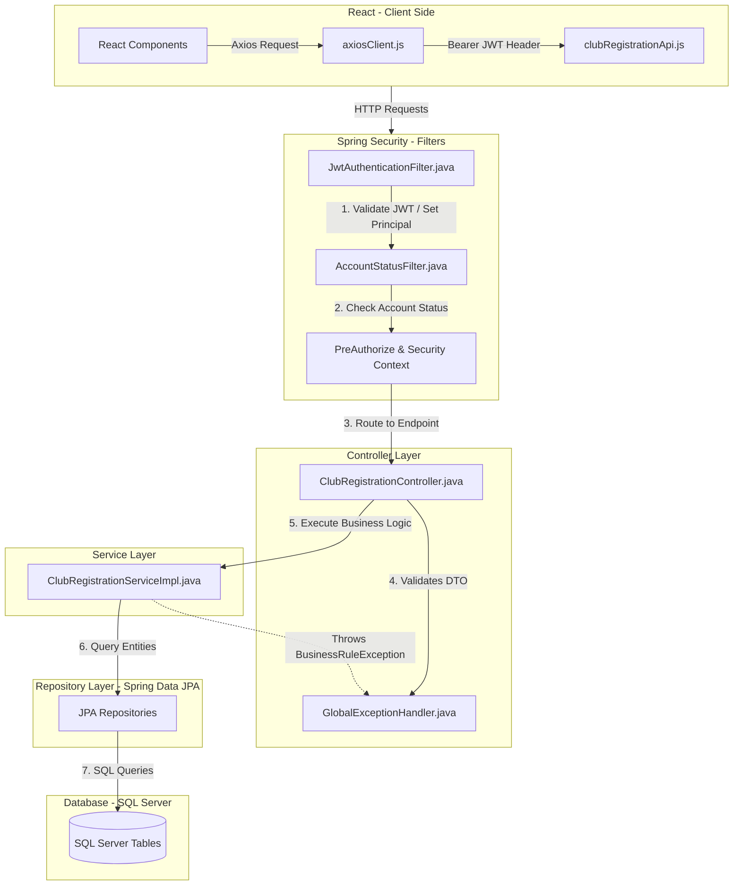
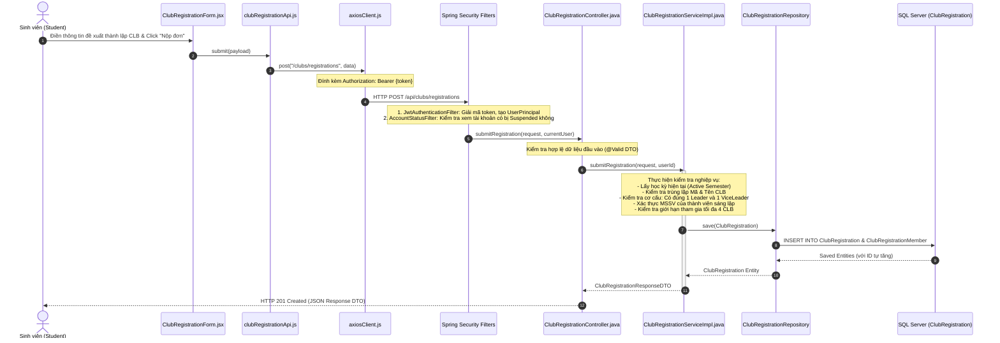
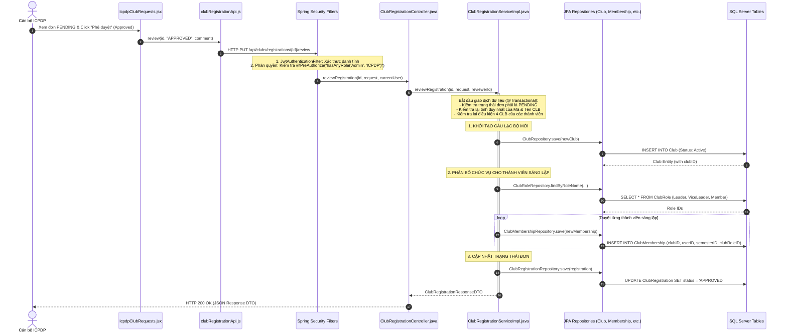

# Request Lifecycle & Call Stack: Tính năng Đăng ký & Phê duyệt CLB

Tài liệu này mô tả chi tiết Vòng đời của Yêu cầu (Request Lifecycle) và Ngăn xếp cuộc gọi (Call Stack) của hệ thống **FCMS (FPT Club Management System)** cho hai luồng nghiệp vụ chính:
1. **Sinh viên nộp đơn đề xuất thành lập Câu lạc bộ mới.**
2. **Cán bộ ICPDP duyệt chấp nhận đơn thành lập và hệ thống tự động khởi tạo CLB.**

---

## Sơ đồ tổng quan kiến trúc luồng dữ liệu



---

## PHẦN 1: SINH VIÊN GỬI YÊU CẦU TẠO CÂU LẠC BỘ

### 1. Sơ đồ trình tự Call Stack (Sequence Diagram)



### 2. Chi tiết các lớp chính tham gia xử lý

| Tầng | Tên File / Lớp (Class) | Phương thức / Thành phần | Vai trò chi tiết trong luồng xử lý |
| :--- | :--- | :--- | :--- |
| **Frontend UI** | [ClubRegistrationForm.jsx](file:///e:/tai_lieu_hoc/5/SWP391/fcms/frontend/src/pages/member/ClubRegistrationForm.jsx) | `handleSubmit()` | - Quản lý form dữ liệu đề xuất thành lập CLB.<br/>- Khi nhập MSSV thành viên, gọi API kiểm tra nhanh thông tin người dùng từ server.<br/>- Đóng gói dữ liệu thành payload JSON để nộp đơn. |
| **Frontend API** | [clubRegistrationApi.js](file:///e:/tai_lieu_hoc/5/SWP391/fcms/frontend/src/services/api/clubs/clubRegistrationApi.js) | `submit(data)` | Gọi phương thức HTTP POST `/api/clubs/registrations` thông qua `axiosClient`. |
| **Frontend Interceptor** | [axiosClient.js](file:///e:/tai_lieu_hoc/5/SWP391/fcms/frontend/src/services/api/axiosClient.js) | `request.use(...)` | Lấy `access_token` từ `localStorage` và tự động gắn vào HTTP Header: `Authorization: Bearer <token>`. |
| **Security Filters** | [JwtAuthenticationFilter.java](file:///e:/tai_lieu_hoc/5/SWP391/fcms/backend/src/main/java/com/fptu/fcms/security/jwt/JwtAuthenticationFilter.java) | `doFilterInternal(...)` | - Bóc tách JWT từ Header.<br/>- Validate token và phân tích các thông tin: `userId`, `email`, `roleId`. <br/>- Lưu trữ thông tin định danh vào `SecurityContextHolder`. |
| **Security Filters** | [AccountStatusFilter.java](file:///e:/tai_lieu_hoc/5/SWP391/fcms/backend/src/main/java/com/fptu/fcms/security/jwt/AccountStatusFilter.java) | `doFilterInternal(...)` | Truy vấn cơ sở dữ liệu để kiểm tra trạng thái hoạt động của tài khoản. Nếu trạng thái là `Suspended`, trả về HTTP 403 Forbidden kèm thông báo lỗi. |
| **Controller** | [ClubRegistrationController.java](file:///e:/tai_lieu_hoc/5/SWP391/fcms/backend/src/main/java/com/fptu/fcms/controller/ClubRegistrationController.java) | `submitRegistration(...)` | - Lắng nghe yêu cầu tại endpoint `POST /api/clubs/registrations`.<br/>- Sử dụng `@Valid` để xác thực định dạng DTO gửi lên.<br/>- Trích xuất thông tin người dùng hiện tại thông qua `@AuthenticationPrincipal UserPrincipal`. |
| **Service** | [ClubRegistrationServiceImpl.java](file:///e:/tai_lieu_hoc/5/SWP391/fcms/backend/src/main/java/com/fptu/fcms/service/impl/ClubRegistrationServiceImpl.java) | `submitRegistration(...)` | - **Kiểm tra nghiệp vụ (Business Rules Validation)**:<br/>&nbsp;&nbsp;1. Kiểm tra tồn tại Học kỳ đang hoạt động (`activeSemester`).<br/>&nbsp;&nbsp;2. Kiểm tra tính duy nhất của Mã CLB (`clubCode`) và Tên CLB (`clubName`).<br/>&nbsp;&nbsp;3. Đảm bảo danh sách thành viên sáng lập có đúng 1 Leader và 1 ViceLeader.<br/>&nbsp;&nbsp;4. Xác thực tất cả MSSV đã có tài khoản trên hệ thống.<br/>&nbsp;&nbsp;5. Kiểm tra giới hạn: các thành viên không tham gia quá 4 CLB trong kỳ này.<br/>- **Chuyển đổi dữ liệu**: Ánh xạ DTO sang entity `ClubRegistration` cùng danh sách `ClubRegistrationMember`. |
| **Repository** | `ClubRegistrationRepository` | `save(...)` | Lưu trữ dữ liệu đề xuất xuống cơ sở dữ liệu. |
| **Database** | Bảng: `ClubRegistration` & `ClubRegistrationMember` | Các câu lệnh tương ứng | Thêm mới dòng dữ liệu với trạng thái mặc định của đơn là `PENDING`. |

---

## PHẦN 2: ICPDP DUYỆT CHẤP NHẬN THÀNH LẬP CLB (ACCEPT)

Khi cán bộ ICPDP bấm nút chấp nhận đơn đăng ký thành lập CLB mới, hệ thống sẽ thực hiện luồng xử lý tự động tạo CLB và phân quyền vai trò cho các thành viên sáng lập.

### 1. Sơ đồ trình tự Call Stack (Sequence Diagram)



### 2. Chi tiết các lớp chính tham gia xử lý

| Tầng | Tên File / Lớp (Class) | Phương thức / Chi tiết xử lý | Vai trò trong luồng duyệt chấp nhận |
| :--- | :--- | :--- | :--- |
| **Frontend UI** | [IcpdpClubRequests.jsx](file:///e:/tai_lieu_hoc/5/SWP391/fcms/frontend/src/pages/icpdp/IcpdpClubRequests.jsx) | `handleReview("APPROVED")` | - Quản lý giao diện duyệt đơn đăng ký dành cho ICPDP.<br/>- Nhận ý kiến phản hồi (`icpdpComment`) và gọi API xử lý duyệt. |
| **Frontend API** | [clubRegistrationApi.js](file:///e:/tai_lieu_hoc/5/SWP391/fcms/frontend/src/services/api/clubs/clubRegistrationApi.js) | `review(id, status, comment)` | Gửi yêu cầu HTTP PUT `/api/clubs/registrations/{id}/review` kèm body chứa `status: "APPROVED"` và bình luận của ICPDP. |
| **Security Gate** | [SecurityConfig.java](file:///e:/tai_lieu_hoc/5/SWP391/fcms/backend/src/main/java/com/fptu/fcms/config/SecurityConfig.java) | `@EnableMethodSecurity` | Kích hoạt cơ chế bảo vệ phương thức dựa trên Role ở tầng Controller. |
| **Controller** | [ClubRegistrationController.java](file:///e:/tai_lieu_hoc/5/SWP391/fcms/backend/src/main/java/com/fptu/fcms/controller/ClubRegistrationController.java) | `reviewRegistration(...)` | - Có annotation `@PreAuthorize("hasAnyRole('Admin', 'ICPDP')")`. Chỉ tài khoản có phân quyền hợp lệ mới được đi qua.<br/>- Gọi service thực hiện việc cập nhật và khởi tạo. |
| **Service** | [ClubRegistrationServiceImpl.java](file:///e:/tai_lieu_hoc/5/SWP391/fcms/backend/src/main/java/com/fptu/fcms/service/impl/ClubRegistrationServiceImpl.java) | `reviewRegistration(...)` | - Đánh dấu `@Transactional` để đảm bảo toàn vẹn dữ liệu (Rollback nếu xảy ra lỗi giữa chừng).<br/>- **Quy trình xử lý nghiệp vụ**:<br/>&nbsp;&nbsp;1. Kiểm tra đơn đăng ký tồn tại và trạng thái hiện tại phải là `PENDING`.<br/>&nbsp;&nbsp;2. Kiểm tra tính duy nhất của mã & tên CLB tại thời điểm duyệt.<br/>&nbsp;&nbsp;3. Kiểm tra lại điều kiện tham gia tối đa 4 CLB của tất cả thành viên.<br/>&nbsp;&nbsp;4. Khởi tạo thực thể `Club` mới (Trạng thái: `Active`), lưu vào DB bằng `ClubRepository.save()`.<br/>&nbsp;&nbsp;5. Truy vấn các vai trò hệ thống (`Leader`, `ViceLeader`, `Member`) từ `ClubRoleRepository`.<br/>&nbsp;&nbsp;6. Duyệt qua từng thành viên sáng lập trong đơn, tạo một bản ghi `ClubMembership` liên kết với `clubID` vừa tạo, tài khoản sinh viên tương ứng, học kỳ hiện tại (`activeSemester`) và vai trò thích hợp.<br/>&nbsp;&nbsp;7. Thay đổi trạng thái đơn đăng ký thành `APPROVED`, đính kèm phản hồi của ICPDP. |
| **Repository** | `ClubRepository` | `save(...)` | Tạo dòng dữ liệu mới trong bảng `Club`. |
| **Repository** | `ClubMembershipRepository` | `save(...)` | Lưu các bản ghi thành viên sáng lập vào bảng liên kết `ClubMembership` với vai trò tương ứng (Chủ nhiệm, Phó chủ nhiệm, Thành viên). |
| **Repository** | `ClubRegistrationRepository` | `save(...)` | Cập nhật trường `status = 'APPROVED'` và `icpdpComment` trong bảng `ClubRegistration`. |

---

## 3. Bản đồ dữ liệu tương tác (Bảng & Cột trong SQL Server)

Dưới đây là các cột dữ liệu chính bị tác động trong quá trình xử lý:

### Bảng 1: `ClubRegistration` (Đơn đăng ký thành lập)
*   **`registrationID`** (PK - IDENTITY): Mã tự tăng.
*   **`clubCode`**, **`clubName`**, **`clubNameEn`**: Mã và tên đề xuất của CLB.
*   **`category`**: Thể loại đề xuất (Academic, Sports, Culture...).
*   **`status`**: Chuyển trạng thái từ `PENDING` thành `APPROVED` (hoặc `REJECTED`).
*   **`icpdpComment`**: Lưu ý kiến nhận xét của cán bộ kiểm duyệt.

### Bảng 2: `ClubRegistrationMember` (Thành viên sáng lập đăng ký)
*   **`memberID`** (PK - IDENTITY): Mã tự tăng.
*   **`registrationID`** (FK): Liên kết tới đơn đăng ký.
*   **`studentId`**: MSSV của thành viên sáng lập.
*   **`proposedRole`**: Vai trò đề xuất (`Leader`, `ViceLeader`, `Member`).

### Bảng 3: `Club` (Thông tin câu lạc bộ được khởi tạo khi được Duyệt)
*   **`clubID`** (PK - IDENTITY): Mã tự tăng được cấp phát sau khi được duyệt.
*   **`clubCode`**, **`clubName`**: Nhận giá trị từ `ClubRegistration`.
*   **`clubStatus`**: Khởi tạo với giá trị mặc định là `"Active"`.

### Bảng 4: `ClubMembership` (Thành viên và chức vụ trong Câu lạc bộ)
*   **`membershipID`** (PK - IDENTITY): Mã tự tăng.
*   **`clubID`** (FK): Liên kết tới `Club` mới được tạo.
*   **`userID`** (FK): ID tài khoản của sinh viên sáng lập (được lấy từ `UserAccount` thông qua `studentId`).
*   **`semesterID`** (FK): ID của học kỳ hiện tại đang hoạt động (`activeSemester`).
*   **`clubRoleID`** (FK): ID vai trò tương ứng (`Leader` hoặc `ViceLeader` hoặc `Member` lấy từ bảng `ClubRole`).
*   **`joinedDate`**: Ngày chính thức tham gia (mặc định lấy ngày hiện tại).

---

## 4. Xử lý Ngoại lệ Toàn cục (Global Exception Handling)

Nếu xảy ra bất kỳ lỗi nghiệp vụ nào ở tầng Service (ví dụ: sinh viên đã tham gia quá 4 CLB, trùng lặp mã CLB vừa được tạo bởi một đơn khác trước đó, hoặc tài khoản sinh viên không tồn tại):
1.  **Service Layer**: Ném ra một `BusinessRuleException(message)`.
2.  **Spring Boot Framework**: Chặn đứng tiến trình xử lý, rollback toàn bộ các thao tác ghi dữ liệu trước đó của giao dịch `@Transactional`.
3.  **GlobalExceptionHandler.java**:
    - Nhận thấy `BusinessRuleException`.
    - Gọi helper `buildErrorResponse(...)`.
    - Trả về mã lỗi HTTP 422 (Unprocessable Entity) hoặc HTTP 400 (Bad Request) dạng JSON chuẩn:
      ```json
      {
        "success": false,
        "timestamp": "2026-06-23T22:44:00.123456",
        "status": 422,
        "error": "Unprocessable Entity",
        "message": "Mã câu lạc bộ đã tồn tại trong hệ thống."
      }
      ```
4.  **Frontend**: Axios interceptor phát hiện mã lỗi $\ge 400$, ném lỗi vào khối `catch (err)` của UI Component để hiển thị thông báo lỗi trực quan cho người dùng qua Toast hoặc Modal cảnh báo.
