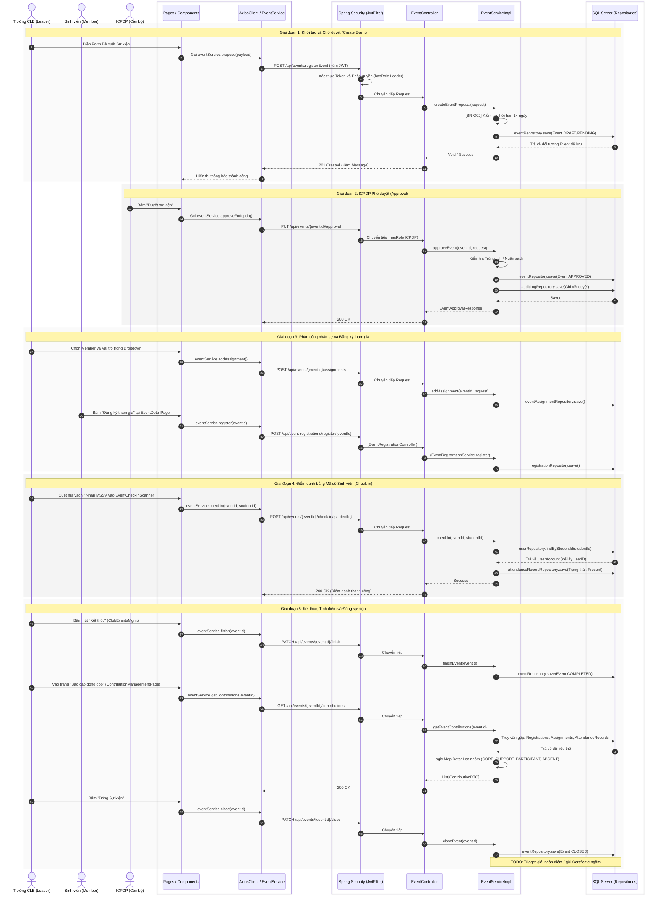

event

```mermaid

sequenceDiagram

    autonumber

    actor L as Trưởng CLB (Leader)

    actor M as Sinh viên (Member)

    actor I as ICPDP (Cán bộ)

    

    box #EBF5FF Frontend (React + Vite)

        participant UI as Pages / Components

        participant AX as AxiosClient / EventService

    end


    box #EBFDF2 Backend (Spring Boot)

        participant SEC as Spring Security (JwtFilter)

        participant CTRL as EventController

        participant SVC as EventServiceImpl

    end


    box #FFF7ED Cơ sở dữ liệu

        participant DB as SQL Server (Repositories)

    end


    %% 1. Khởi tạo sự kiện

    rect rgba(200, 200, 200, 0.1)

        Note over L, DB: Giai đoạn 1: Khởi tạo và Chờ duyệt (Create Event)

        L->>UI: Điền Form Đề xuất Sự kiện

        UI->>AX: Gọi eventService.propose(payload)

        AX->>SEC: POST /api/events/registerEvent (kèm JWT)

        SEC->>SEC: Xác thực Token và Phân quyền (hasRole Leader)

        SEC->>CTRL: Chuyển tiếp Request

        CTRL->>SVC: createEventProposal(request)

        SVC->>SVC: [BR-G02] Kiểm tra thời hạn 14 ngày

        SVC->>DB: eventRepository.save(Event DRAFT/PENDING)

        DB-->>SVC: Trả về đối tượng Event đã lưu

        SVC-->>CTRL: Void / Success

        CTRL-->>AX: 201 Created (Kèm Message)

        AX-->>UI: Hiển thị thông báo thành công

    end


    %% 2. ICPDP Duyệt sự kiện

    rect rgba(200, 200, 200, 0.2)

        Note over I, DB: Giai đoạn 2: ICPDP Phê duyệt (Approval)

        I->>UI: Bấm "Duyệt sự kiện"

        UI->>AX: Gọi eventService.approveForIcpdp()

        AX->>SEC: PUT /api/events/{eventId}/approval

        SEC->>CTRL: Chuyển tiếp (hasRole ICPDP)

        CTRL->>SVC: approveEvent(eventId, request)

        SVC->>SVC: Kiểm tra Trùng lịch / Ngân sách

        SVC->>DB: eventRepository.save(Event APPROVED)

        SVC->>DB: auditLogRepository.save(Ghi vết duyệt)

        DB-->>SVC: Saved

        SVC-->>CTRL: EventApprovalResponse

        CTRL-->>AX: 200 OK

    end


    %% 3. Đăng ký & Phân công

    rect rgba(200, 200, 200, 0.1)

        Note over L, DB: Giai đoạn 3: Phân công nhân sự và Đăng ký tham gia

        L->>UI: Chọn Member và Vai trò trong Dropdown

        UI->>AX: eventService.addAssignment()

        AX->>SEC: POST /api/events/{eventId}/assignments

        SEC->>CTRL: Chuyển tiếp Request

        CTRL->>SVC: addAssignment(eventId, request)

        SVC->>DB: eventAssignmentRepository.save()

        

        M->>UI: Bấm "Đăng ký tham gia" tại EventDetailPage

        UI->>AX: eventService.register(eventId)

        AX->>SEC: POST /api/event-registrations/register/{eventId}

        SEC->>CTRL: (EventRegistrationController)

        CTRL->>SVC: (EventRegistrationService.register)

        SVC->>DB: registrationRepository.save()

    end


    %% 4. Điểm danh

    rect rgba(200, 200, 200, 0.2)

        Note over L, DB: Giai đoạn 4: Điểm danh bằng Mã số Sinh viên (Check-in)

        L->>UI: Quét mã vạch / Nhập MSSV vào EventCheckInScanner

        UI->>AX: eventService.checkIn(eventId, studentId)

        AX->>SEC: POST /api/events/{eventId}/check-in/{studentId}

        SEC->>CTRL: Chuyển tiếp Request

        CTRL->>SVC: checkIn(eventId, studentId)

        SVC->>DB: userRepository.findByStudentId(studentId)

        DB-->>SVC: Trả về UserAccount (để lấy userID)

        SVC->>DB: attendanceRecordRepository.save(Trạng thái: Present)

        SVC-->>CTRL: Success

        CTRL-->>AX: 200 OK (Điểm danh thành công)

    end


    %% 5. Báo cáo & Đóng sự kiện

    rect rgba(200, 200, 200, 0.1)

        Note over L, DB: Giai đoạn 5: Kết thúc, Tính điểm và Đóng sự kiện

        L->>UI: Bấm nút "Kết thúc" (ClubEventsMgmt)

        UI->>AX: eventService.finish(eventId)

        AX->>SEC: PATCH /api/events/{eventId}/finish

        SEC->>CTRL: Chuyển tiếp

        CTRL->>SVC: finishEvent(eventId)

        SVC->>DB: eventRepository.save(Event COMPLETED)

        

        L->>UI: Vào trang "Báo cáo đóng góp" (ContributionManagementPage)

        UI->>AX: eventService.getContributions(eventId)

        AX->>SEC: GET /api/events/{eventId}/contributions

        SEC->>CTRL: Chuyển tiếp

        CTRL->>SVC: getEventContributions(eventId)

        SVC->>DB: Truy vấn gộp: Registrations, Assignments, AttendanceRecords

        DB-->>SVC: Trả về dữ liệu thô

        SVC->>SVC: Logic Map Data: Lọc nhóm (CORE, SUPPORT, PARTICIPANT, ABSENT)

        SVC-->>CTRL: List[ContributionDTO]

        CTRL-->>AX: 200 OK

        

        L->>UI: Bấm "Đóng Sự kiện"

        UI->>AX: eventService.close(eventId)

        AX->>SEC: PATCH /api/events/{eventId}/close

        SEC->>CTRL: Chuyển tiếp

        CTRL->>SVC: closeEvent(eventId)

        SVC->>DB: eventRepository.save(Event CLOSED)

        Note over SVC, DB: TODO: Trigger giải ngân điểm / gửi Certificate ngầm

    end

```
